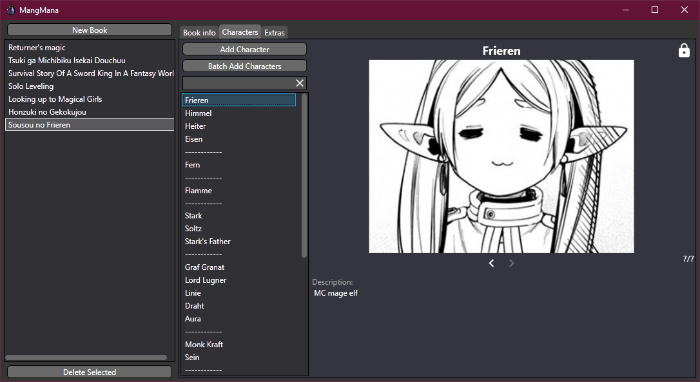

# MangMana 
A comprehensive, private comic/book/show/movie manager for people whose memory isn't perfect for stories that contain a lot of characters, especially if the stories are released in long time intervals, and the only sources of information are dubious wikis that are outdated, incomplete and/or filled with spoilers.

## Table of contents
 - [Features]
   - [Book info]
   - [Characters list]
   - [Extras]
 - [Technologies]
 - [Credits]

## Features
#### Book info
 - Important notes about the story and cover art
 - Extras page for storing full-resolution images
 - Live data backup in case of unexpected exit

#### Characters list
 - A clan list of characters with their thumbnail photos and notes.
   - Images can be dropped straight into the window to add it for current character.
 - Batch characters adding
   - Quickly add multiple characters at once

#### Extras
 - Additional page for storing full-resolution images (views, world maps, important pictures, etc.)

##### Double-click any field to quickly enter edit mode
##### Lists can be reorganized by dragging and dropping the items

## Technologies
 - .NET 5
 - WPF

## Credits
 - [Material Design](https://material.io/resources/icons) icons
 - [Mana potion icon](https://diablo-archive.fandom.com/wiki/File:Supermana.gif) from Diablo II
 - [PropertyChanged.Fody](https://github.com/Fody/PropertyChanged) v3.3.1

